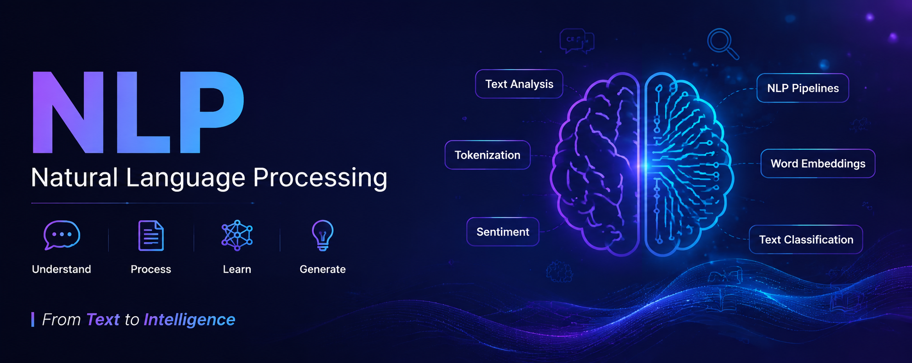

<div align="center">



# 🧠 NLP — Natural Language Processing from Scratch

### A structured, hands-on journey through classical & modern NLP techniques in Python

<p>
  
  
  
  
  
  
</p>

<p>
  
  
  
</p>

</div>

---

## 📖 About

This repository is my personal, hands-on record of learning **Natural Language Processing (NLP)** from regex basics all the way to word embeddings and topic modeling. Every notebook is self-contained: clear explanations, runnable code, worked examples, and solved exercises, so anyone (including future-me) can pick it up and follow along without needing outside context.

Notebooks are numbered in the order they should be studied — each one builds on the concepts from the last.

---

## 🗂️ What's Inside

| # | Notebook | Covers |
|---|---|---|
| 01 | [`01_regex_for_nlp.ipynb`](./01_regex_for_nlp.ipynb) | Regular expressions for text cleaning & pattern extraction |
| 02 | [`02_nltk_vs_spacy.ipynb`](./02_nltk_vs_spacy.ipynb) | Comparing the two major classical NLP libraries |
| 03 | [`03_spacy_tokenizer.ipynb`](./03_spacy_tokenizer.ipynb) | Tokenization rules & customization in spaCy |
| 04 | [`04_spacy_pipelines.ipynb`](./04_spacy_pipelines.ipynb) | Blank vs trained pipelines, pipeline components |
| 05 | [`05_stemming_lemmatization.ipynb`](./05_stemming_lemmatization.ipynb) | Reducing words to base form — NLTK stemming vs spaCy lemmatization |
| 06 | [`06_parts_of_speech.ipynb`](./06_parts_of_speech.ipynb) | POS tagging (`pos_` vs `tag_`), filtering tokens by grammar |
| 07 | [`07_name_entity_recognition.ipynb`](./07_name_entity_recognition.ipynb) | Extracting people, places, orgs, dates & more |
| 08 | [`08_bag_of_words.ipynb`](./08_bag_of_words.ipynb) | Bag of Words + real-world ML classification (spam & sentiment) |
| 09 | [`09_stop_words_nlp.ipynb`](./09_stop_words_nlp.ipynb) | Stop word removal  when it helps and when it backfires |
| 10 | [`10_bag_of_n_gram.ipynb`](./10_bag_of_n_gram.ipynb) | N-grams, news category & fake news classification |
| 11 | [`11_TF_IDF.ipynb`](./11_TF_IDF.ipynb) | Term Frequency–Inverse Document Frequency + emotion detection |
| 12 | [`12_spacy_word_vectors.ipynb`](./12_spacy_word_vectors.ipynb) | Pre-trained word embeddings, similarity, analogies |
| 13 | [`13_spacy_word_embeddings_text_classification.ipynb`](./13_spacy_word_embeddings_text_classification.ipynb) | Using embeddings as ML features for classification |
| — | [`gensim.ipynb`](./gensim.ipynb) | Gensim basics — Dictionary, BOW, TF-IDF, Word2Vec, LDA topic modeling |
| — | [`fasttext_basics.ipynb`](./fasttext_basics.ipynb) | FastText subword embeddings & out-of-vocabulary handling |

**Datasets included:** `spam.csv` (for notebook 08), `students.txt` (for notebook 03)

---

## 🛠️ Tech Stack

- **Language:** Python
- **Core NLP libraries:** spaCy, NLTK
- **ML & data:** scikit-learn, pandas, numpy
- **Visualization:** matplotlib, seaborn

---

## 🚀 Getting Started

```bash
# clone the repo
git clone https://github.com/Ali-Hamza-developer/NLP.git
cd NLP

# install dependencies
pip install spacy nltk gensim fasttext-wheel scikit-learn pandas numpy matplotlib seaborn

# download spaCy models used across the notebooks
python -m spacy download en_core_web_sm
python -m spacy download en_core_web_lg

# open any notebook
jupyter notebook
```

Each notebook is self-contained — dependencies and any required setup are noted at the top of the file. Where a real-world dataset would normally be needed, notebooks fall back to a small synthetic dataset automatically if the file isn't found, so everything runs out of the box.

---

## 🙏 Credits

This learning path follows the excellent free **[NLP Tutorial For Beginners](https://www.youtube.com/playlist?list=PLeo1K3hjS3uuvuAXhYjV2lMEShq2UYSwX)** playlist by [codebasics](https://www.youtube.com/@codebasics) — notebooks here extend the original exercises with deeper explanations, extra examples, and additional practice problems.

---

## 📬 Connect With Me

<p>
  <a href="https://alihamzadev.vercel.app"></a>
  <a href="https://www.linkedin.com/in/alihamzastudent/"></a>
</p>

<div align="center">
<sub>Built by Ali Hamza  — BSCS, National University of Modern Languages (NUML)</sub>
</div>
